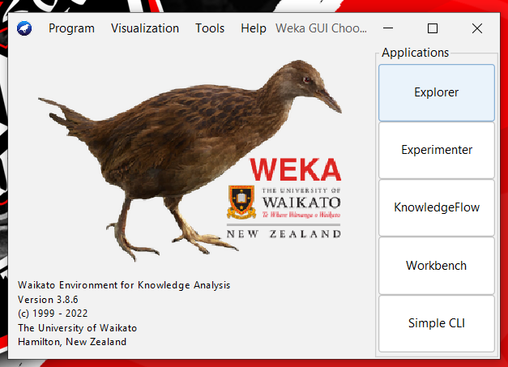
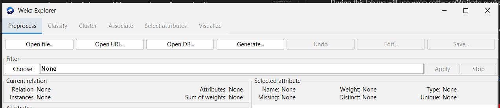
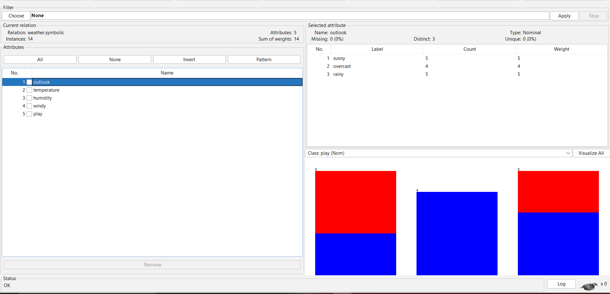
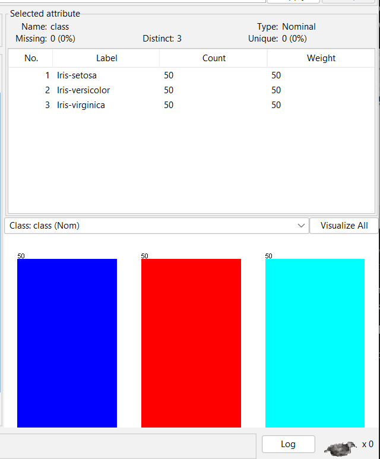
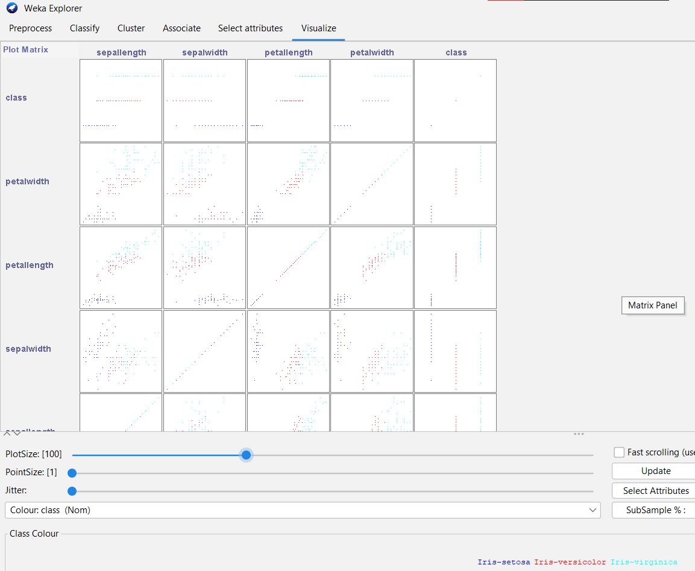
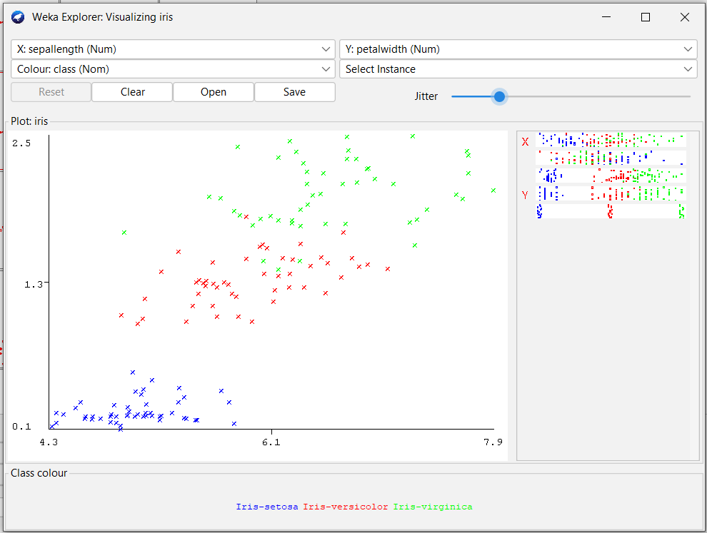
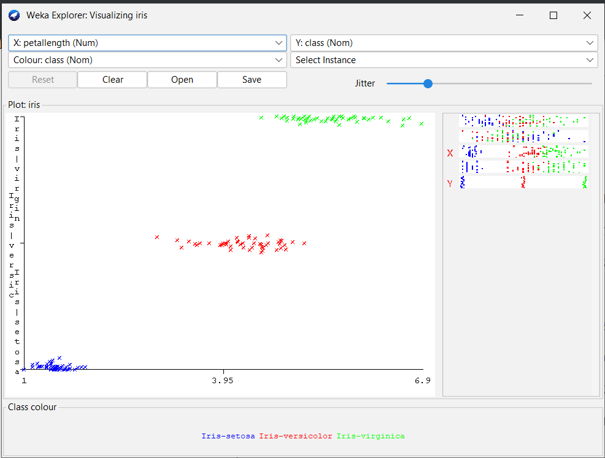
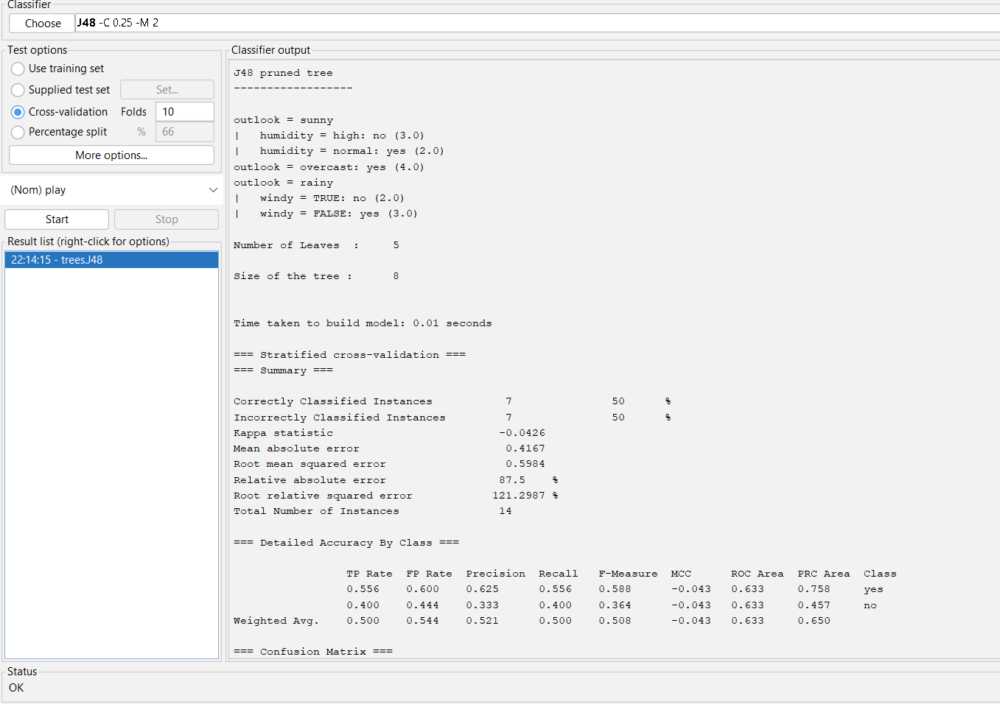
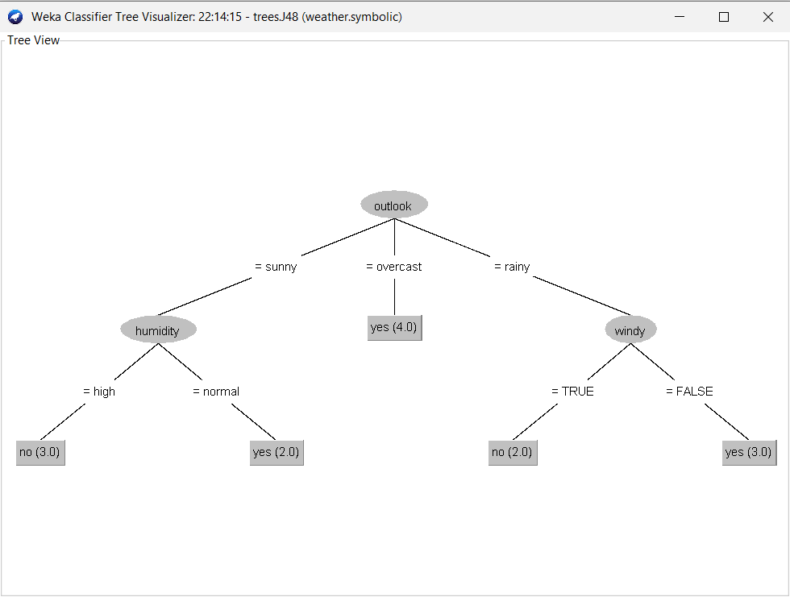

 During this lab we will use **weka** software (Waikato environment for knowledge analysis)

Weka is a collection of **machine learning** algorithms for data mining tasks. The algorithms can either be applied directly to a dataset or called from your own Java code. Weka contains tools for data **pre-processing, classification, regression, clustering, association rules, and visualization.**

Weka is free to use : https://www.cs.waikato.ac.nz/ml/weka/

During this lab we will use the user interface of weka
  

 
Make sure to copy the content of (C:\Program Files\Weka-3-8\data) in your working directory: we will need it in this lab

Choose the explorer: 6 options are available:
  

Data format is ARFF (Attribute-Relation File Format)

click open file in Preprocess and choose any dataset from the data files. We chose weather.nominal.arff
  

Weka helps in the visualization of the data and the different outcomes of mixing attributes.

You can try selecting different attributes and using the ALL,NONE,INVERT options..

 **iris.arff** is the most used dataset for data mining researchs.

 The data set contains 3 classes of 50 instances each, where each class refers to a type of iris plant.

  

Go to the visualize window, you can see 25 graphics combinig each 2 attributes with the classes colored.

 

The lab suggests that we choose petal width as X and sepal length as Y:
 

if we choose class(nom) as an axe, we can conclude some association laws:
in this example iris-setosa is linked with low petal length values:

 

The jitter option can get another distribution of points if they are not clear.
  

# **Decision Trees**

We will reopen weather.nominal.arff and use J48 algorithm

Classify >> Trees >> J48 >> Start

J48 Classifier is an algorithm to generate a decision tree that is generated by C4. 5 (an extension of ID3). It is also known as a statistical classifier.

We can visualize the decision tree (right click on model name)
 

# Preprocessing Data

open bank-data.arff

 
Weka include many filters that can be used before invoking a classifier to clean up the dataset, or alter it in some way. Filters help with data preparation.

 

Attribute selection is a supervised attribute filter that can be used to select attributes. It is very flexible and allows various search and evaluation methods to be combined.

 
Discretize filter is an instance filter that discretizes a range of numeric attributes in the dataset into nominal attributes. Discretization is by simple binning.

